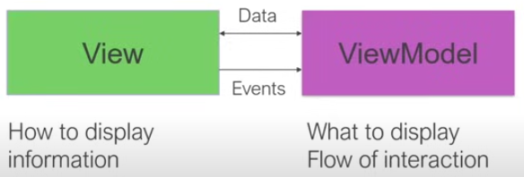

# Part 2 - MVVM

## The basics

### [View-Model-ViewModel](https://youtu.be/DuNLR_NJv8U?t=3454)
   
1. Is an architecture pattern used to **separate of concerns** of the Code.
   
2. **View** -  *How to display* the information, it doesn't know about where the data is coming from or the data types. It just display data in a specific way. The view notify the ViewModel when the events happens, for example, when a button is clicked.
   
3. **ViewModel** - It's like the code behind of View. Tells the page *what to display*. It controls the flow of interaction, it's going to do two way back and forth updates of *what to display*. When things change, notify the View that things need to be updated. The picure below show the interaction between View and ViewModel.

    

  

4. AAAA

### [Data Binding](https://youtu.be/DuNLR_NJv8U?t=3632)

## [Let's do it!](https://youtu.be/DuNLR_NJv8U?t=4139)