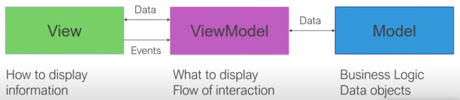
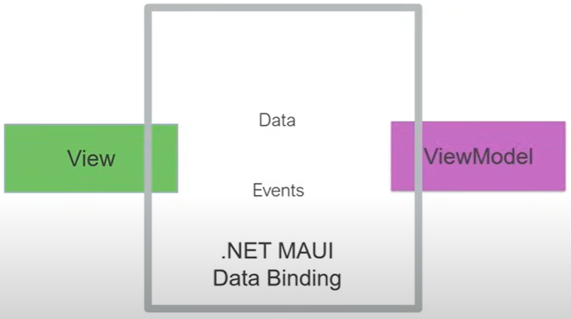

# Part 2 - MVVM

## [View-ViewModel-Model](https://youtu.be/DuNLR_NJv8U?t=3454)

1. Is an architecture pattern used to **separation of concerns** of the Code. The image below shows the interaction between View, ViewModel and Model.

<p align="center">
    
</p>  

2. **View** -  *How to display* the information, it doesn't know about where the data is coming from or the data types. It just display data in a specific way. The view notify the ViewModel when the events happens, for example, when a button is clicked.

3. **ViewModel** - It's like the code behind of View. Tells the page *what to display* without knowing where the data is comes from. It controls the flow of interaction, it's going to do two way back and forth updates of *what to display*. When things change, notify the View that things need to be updated

4. **Model** - Business logic and Data handling. The Model encapsulates the application's business logic and manages data. Essentially, it's responsible for handling data persistence and manipulation.

## [Data Binding](https://youtu.be/DuNLR_NJv8U?t=3632)

1. **Data Binding** synchronizes the values of UI elements (views) with underlying data (often from a view model). When the data property changes or the events happen, for example, the view automatically reflects the update. The image below shows the interaction between View, Data Binding and ModelView

<p align="center">
    
</p>  

2. **INotifyPropertyChanged** - The INotifyPropertyChanged interface is used to notify binding clients that a property value has changed. When a property in the ViewModel changes, it raises the **PropertyChanged** event causing the View reflects that change.

## Let's do it!

Creating a list of monkeys and populating that inside of our user interface Instead of hard coding that data

1. Install the CommunityToolkit.Mvvm

* **CommunityToolkit.Mvvm** is a library that simplifies the implementation of the MVVM pattern in .Net applications. It includes an abstract base class called **ObservableObject**.

* When a ViewModel class inherits from the ObservableObject class, it automatically handles property change notifications without requiring manual implementation of the interface.

2. Implements the BaseViewModel class as shown in the code below:
   
```
namespace MonkeyFinder.ViewModel;

public partial class BaseViewModel : ObservableObject
{
    public BaseViewModel()
    { 
    }

    [ObservableProperty]
    [NotifyPropertyChangedFor(nameof(IsNotBusy))]
    bool isBusy;

    [ObservableProperty]
    string title;

    public bool IsNotBusy => !IsBusy;
}
```

3. Implements the [MonkeyService](https://youtu.be/DuNLR_NJv8U?t=5541) class as shown in the code below:

```
using System.Net.Http.Json;

namespace MonkeyFinder.Services;

public class MonkeyService
{
    HttpClient httpClient;

    public MonkeyService()
    {
        httpClient = new HttpClient();
    }

    List<Monkey> monkeyList = new();

    public async Task<List<Monkey>> GetMonkeys()
    {
        if (monkeyList?.Count > 0)
            return monkeyList;

        var url = "montemagno.com/monkeys.json";
        var response = await httpClient.GetAsync(url);

        if (response.IsSuccessStatusCode)
        {
            monkeyList = await response.Content.ReadFromJsonAsync<List<Monkey>>();
        }

        return monkeyList;
    }
}
```

4. Implements the [MonkeysViewModel](https://youtu.be/DuNLR_NJv8U?t=6029) class as shown in the code below:
   
```
using MonkeyFinder.Services;

namespace MonkeyFinder.ViewModel;

public partial class MonkeysViewModel : BaseViewModel
{
    MonkeyService monkeyService;
    public ObservableCollection<Monkey> Monkeys { get; } = new();
    public MonkeysViewModel(MonkeyService monkeyService)
    {
        Title = "Monkey Finder";
        this.monkeyService = monkeyService;
    }

    [RelayCommand]
    async Task GetMonkeysAsync()
    {
        if (IsBusy)
            return;

        try
        {
            IsBusy = true;
            var monkeys = await monkeyService.GetMonkeys();

            if (Monkeys.Count != 0)
                Monkeys.Clear();

            foreach (var monkey in monkeys)
                Monkeys.Add(monkey);
        }
        catch (Exception ex)
        {
            Debug.WriteLine(ex);

            await Shell.Current.DisplayAlert(
                "Error!", 
                $"Unable to get monkeys: {ex.Message}", 
                "OK"
            );
        }
        finally
        {
            IsBusy = false;
        }
    }
}
```

5. [Register dependency](https://youtu.be/DuNLR_NJv8U?t=6812). Open and edit the MauiProgram class as shown in the code below:

```
using Microsoft.Extensions.Logging;
using MonkeyFinder.Services;
using MonkeyFinder.View;

namespace MonkeyFinder;

public static class MauiProgram
{
	public static MauiApp CreateMauiApp()
	{
        ... 

        builder.Services.AddSingleton<MonkeyService>();
        builder.Services.AddSingleton<MonkeysViewModel>();

        builder.Services.AddSingleton<MainPage>();

		return builder.Build();
	}
}

```

6. [Linking](https://youtu.be/DuNLR_NJv8U?t=6943) the page with the ViewModel. Open the **MainPage** class and edit it as shown in the code below:
   
```
namespace MonkeyFinder.View;

public partial class MainPage : ContentPage
{
	public MainPage(MonkeysViewModel viewModel)
	{
		InitializeComponent();
		BindingContext = viewModel;
    }
}
```
   
7. Starting to build the user interface
8. First version of the Monkey Finders app


# Next part -> https://youtu.be/DuNLR_NJv8U?t=8173